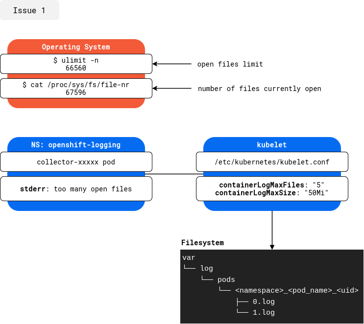

# Issue 1

## Description

:boom: **Root Cause**: An issue occurred on one of the `worker` node in the cluster. The NVIDIA GPU Operator caused the `worker` node to repeatedly switch between `Schedulable` and `Unschedulable` state.

:bug: **Side effect**: Several PODs in `openshift-storage`, `openshift-sdn` or `openshift-storage` were restarted over +2000 times, resulting in the creation of numerous log files in the folder `/var/log/pods`. 

Since the `ulimit -n` value is set to `66560`, the number of open log files reached the limit and preventing the `collector` pod from processing the logs.

:mag: **Observation**: In the `/var/log/pods` directory, a folder is created following the format `/var/log/pods/<namespace>_<pod_name>_<pod_uid>/<container_name>/<n>.log`. As long as a POD with the same UID exists, the log files will remain open if they are not processed.

## Diagram



## Gather Information

To gather relevant information, I created a shell script to fetch different values for better understanding.

```shell
$ git clone https://github.com/ht-vo/openshift-notes.git

$ chmod +x openshift-notes/issues/issue1-openshift-logging/issue1.sh

$ ./openshift-notes/issues/issue1-openshift-logging/issue1.sh
```

**Note**: Ignore the message `error: non-zero exit code from debug container`. The `lsof` command returns an exit code `1` because it indicates there are no open files in some folders.

## Solutions

- [ ] Increase the `ulimit -n` value

OR

- [ ] Delete the targeted POD